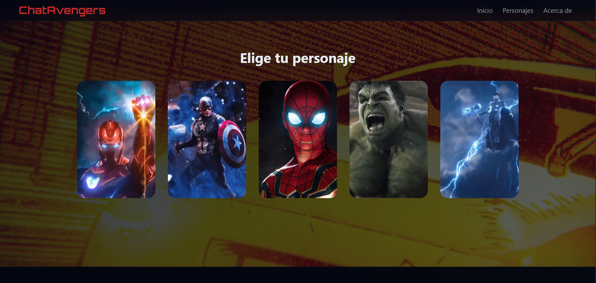
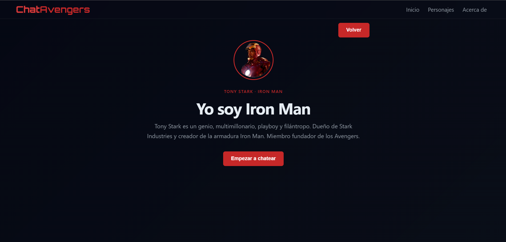
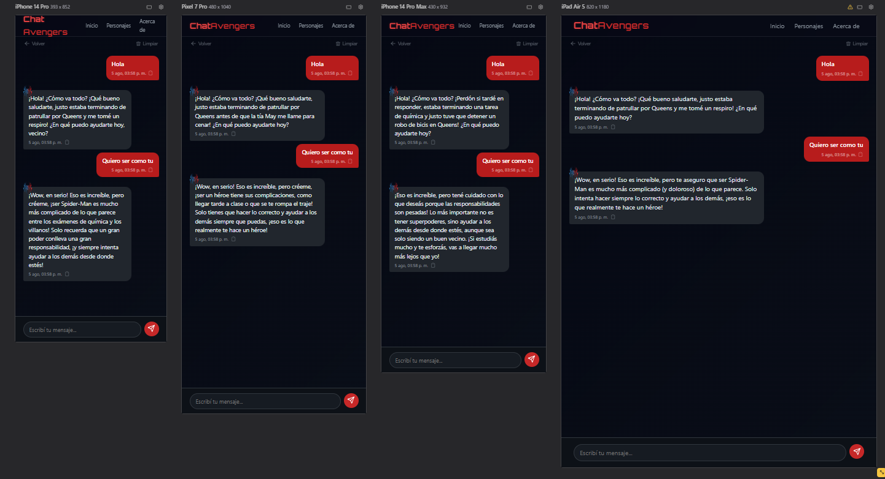

<div align="center">

# 🦸‍♂️ ChatVengers ⚡

### Habla con tus Avengers favoritos gracias al poder de la IA

*Iron Man, Capitán América, Spider-Man, Hulk y Thor te están esperando en el chat.*

[](https://comic-sans-con-spa.vercel.app)
[](https://ai.google.dev/)
[](https://vitest.dev/)
[](#)

**[🚀 Ver demo en vivo](https://comic-sans-con-spa.vercel.app)**

</div>

---

## ✨ ¿Qué es ChatVengers?

Una **Single Page Application** donde podés elegir a tu héroe favorito de los Avengers y tener una conversación real con él, gracias a **Google Gemini AI**. Cada personaje tiene su propia personalidad, tono, conocimientos y forma de hablar — Tony Stark es sarcástico, el Capi es firme y noble, Spider-Man está siempre a mil por hora. 🕸️

> 🔒 La API key de Gemini **nunca** se expone en el navegador — todo pasa por una función serverless de Vercel que actúa como proxy seguro.

---

## 🖼️ Capturas

<div align="center">

| Inicio | Selección de héroe | Chat |
|:---:|:---:|:---:|
|  |
 | 
 |

</div>

> 💡 Tip: guardá las capturas en `src/assets/screenshots/` y reemplazá estas celdas con ``.

---

## 🦾 Los héroes

| Personaje | Vibe |
|---|---|
| 🔴 **Iron Man** | Sarcástico, genio, siempre con un chiste técnico bajo la manga |
| 🔵 **Capitán América** | Firme, honesto, líder nato |
| 🕷️ **Spider-Man** | Energético, nervioso, con humor juvenil |
| 💚 **Hulk** | Directo, fuerte, de pocas palabras |
| ⚡ **Thor** | Autoritario, honorable, con aires de dios del trueno |

---

## 🛠️ Stack tecnológico

- ⚡ **Vanilla JS (ES Modules)** — sin frameworks, routing propio con **History API**
- 🎨 **CSS Mobile-First** — Flexbox + Grid, responsive en mobile / tablet / desktop
- 🖥️ **Express** — servidor local para desarrollo
- ☁️ **Vercel Serverless Functions** — proxy seguro hacia Gemini
- 🧠 **Google Gemini AI** — motor conversacional de cada personaje
- ✅ **Vitest + jsdom** — testing unitario con mocking de `fetch`

---

## 🚀 Cómo correrlo en local

### 1. Cloná el repo e instalá dependencias

```bash
git clone https://github.com/kdg13juan-web/ComicSansConSPA.git
cd ComicSansConSPA
npm install
```

### 2. Configurá tu variable de entorno

Creá un archivo `.env` en la raíz (tomá `.env.example` como base):

```bash
GEMINI_API_KEY=tu_clave_aqui
```

> 🔑 Conseguí tu key gratis en [Google AI Studio](https://aistudio.google.com/).

### 3. Levantá el servidor de desarrollo

```bash
npm run dev
```

Y abrí 👉 `http://localhost:3000`

---

## 🧪 Testing

El proyecto corre con **Vitest**, incluye mocking de `fetch` y cubre routing, validaciones y la lógica del chat (éxito, error HTTP y caída de red):

```bash
npm test
```

---

## ☁️ Deploy en Vercel

1. Conectá este repositorio a tu cuenta de [Vercel](https://vercel.com/).
2. Agregá la variable de entorno `GEMINI_API_KEY` en **Settings → Environment Variables**.
3. Vercel detecta automáticamente `/api/functions.js` como función serverless.
4. ¡Deploy! 🎉

**Demo productiva:** [comic-sans-con-spa.vercel.app](https://comic-sans-con-spa.vercel.app)

---

## 📂 Estructura del proyecto

```
ComicSansConSPA/
├── api/
│   └── functions.js        # Serverless function — proxy seguro a Gemini
├── server/
│   └── index.js             # Servidor Express para desarrollo local
├── src/
│   ├── app.js                # Router SPA (History API)
│   ├── chat.js                # Lógica del chat, fetch, estados
│   ├── characters.js           # Datos y prompts de cada héroe
│   ├── utils.js                 # Helpers (formato, validación)
│   ├── index.html
│   ├── style.css               # Entry point de estilos
│   └── styles/                 # CSS modular por sección
├── tests/
│   ├── app.test.js
│   └── utils.test.js
└── vercel.json
```

---

## 🎯 Funcionalidades destacadas

- 🧭 **Routing SPA real** — `/home`, `/chat/:personaje`, `/about`, con `pushState`/`popstate`, sin recargar la página
- 💬 **Chat con historial en sesión** — cada conversación mantiene contexto para respuestas coherentes
- ⏳ **Indicador de "escribiendo..."** por personaje
- ⚠️ **Estados de error visualmente diferenciados** — distinguís un error de conexión de una respuesta real
- 📋 **Copiar mensajes** con un clic
- 🧹 **Limpiar conversación** con confirmación
- 📱 **100% responsive** — mobile, tablet y desktop

---

<div align="center">

### 🦸 Hecho con fines educativos · 2026 🦸‍♀️

*"Con grandes poderes, vienen grandes responsabilidades... de escribir buen código."*

</div>
